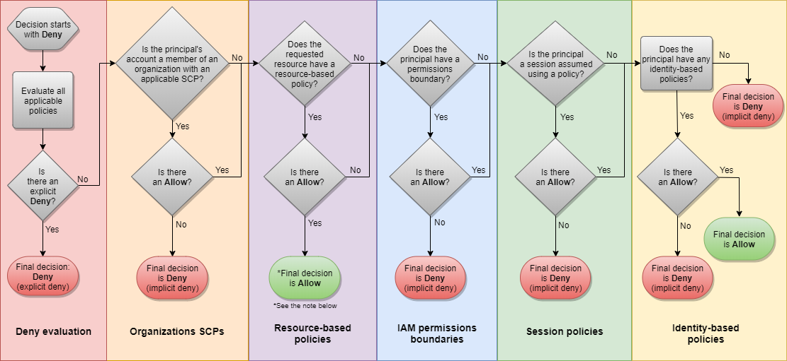

# IAM Policy Evaluation Logic
- AWS's Logical OR when evaluating statements can run into problems like: What happens when two policy statements contradict each other?
- AWS completes a series of steps to determine if they should allow or deny a certain request
    1. Authentication - authenticates the principal who makes the request.
        - Not required if the resource allows anonymous request
    2. Process the request context
        - Processes the request context to determine the specific policies that apply to the request
    3. Evaluate all policies within a single account
        - Evaluates all the policy types in the account that may the affect the exact order in which the policies are evaluated

- If the IAM policies are within a single account....
    1. All requests will be implicitly denied, exception to the root user. 
    2. Process the explicit ALLOW statements for identity-based or resource-based policy
        - May override the explicit ALLOW with the implicit DENY if theres a Permissions Boundary, Session Policies, or Service Control Policies (SCPs)
    3. An explicit DENY in any policy overrides any type of ALLOW actions.    
    
        -  Explicit Deny > Explicit Allow > Implicit Deny > ~~Implicit Allow~~ (does not exist)