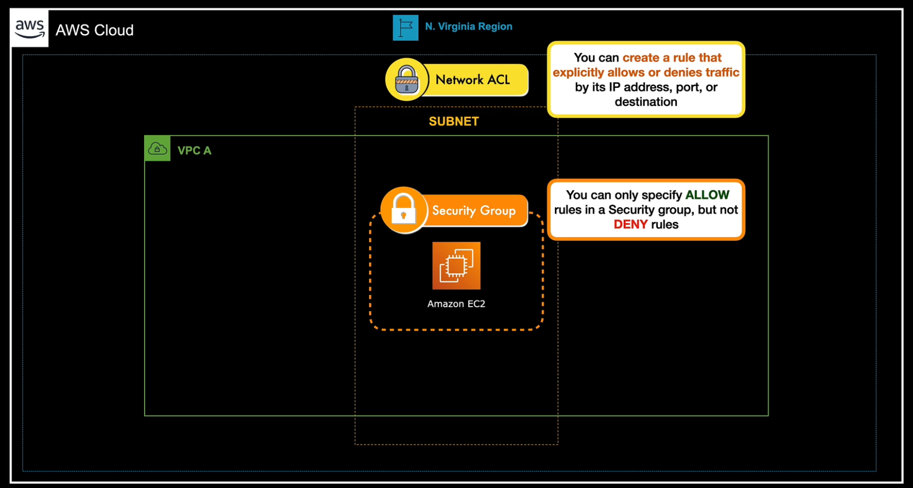

# Anatomy of an Amazon VPC
- A VPC is private by default
- Amazon VPC has various interconnected components that allow it to perform many functions
    - An internal framework composed of a route table, several subnets (both public and private) a CIDR block, a collection of gateways (that allow incoming/outgoing traffic) and a management system that enables the control and integration to other VPCs or AWS resources (AWS IAM).
- There are many different types of Amazons VPCs that exist inside the AWS global network. Think of these different types as the "gates" that act as entrance or exit doors. 
    - Can configure VPCs to allow communication to your on-premises network or to the public internet.
    - A connection to other VPCs is possible using VPC Peering.
- An Amazon VPC is a regional resource (can only exist inside a specific AWS region).
- Every VPC can have one or more subnets where AWS resources can be placed.
    - These subnets are mapped to certain availability zones that span across multiple data centers.
        - You can place multiple subnets in a single availability Zone.
    - Because Amazon VPC is regional in scope, it can use different data centers that are in a specific region (say us-east-1).
- Some AWS resources can and cannot be placed in your VPC.
    - Cannot launch a new Amazon S3 bucket inside your VPC because Amazon S3 is a regional resource that can't be placed in a subnet. Same goes for AWS Lambda and Amazon DynamoDB.
    - What can be done instead is set a direct connection for these services using a **VPC Endpoint**

### VPC Endpoint
- Allows for private connectivity between your EC2 instances and other AWS services without the traffic passing through public internet.
- Traffic between VPC and other services does not leave the Amazon network.
    
### Amazon VPC Components
- CIDR (Classless Inter-Domain Routing) blocks
    - When you create an Amazon VPC, you must chose a primary CIDR block for your network.
    - This simply allows you how small or how big your network will be.
    - Allowed block size for a VPC is between /16 to /28 netmask.
        - A netmask (subnet mask) tells you the total number of available hosts for your network.
        - The higher it is, the fewer its available hosts would be (Notice the pattern between each number increase - its being cut by half) :
            - A /16 netmask translates to 65,526 IP addresses.
            - A /17 netmask translates to 32,768 IP addresses.
            - A /18 netmask translates to 16,384 IP addresses.
            - The smallest netmask (/28) translates to 16 IP addresses.
        - This allows you to launch tens of thousands of EC2 instances and other resources in your VPC. If your cloud architecture is small, then its best to keep the CIDR block small.
    - AWS reserves a total of 5 IP addresses from your CIDR block. This means not all your available addresses will not be useable.
        - The first four IP addresses and the last IP address in each subnet CIDR block are reserved by AWS.
            - Example, a subnet with CIDR block 10.0.0.0/24, the follow are reserved:
                - 10.0.0.0 - Network Address
                - 10.0.0.1 - VPC Router
                - 10.0.0.2 - DNS Server
                - 10.0.0.3 - Reserved for Future Use
                - 10.0.0.255 - Network Broadcast Address
    - Supports both IPv4 (10.0.0.0/16) and IPv6 CIDR (2001:db8:1234:1a00::/56) range
    - Secondary CIDR blocks can be created to further expand your VPC.
    - Can also operate in dual-stack mode, meaning resources can communicate over IPv4, IPv6, or both. 
        - IPv4 is the default IP addressing system for both Amazon VPC and Amazon EC2. Support for IPv4 cannot be disabled for either subnets or VPC.
- Subnets
    - A network inside of a network. Subnets make networks more efficient. Through subnetting, network traffic can travel a shorter distance without passing through unnecessary routers to reach its destination.
- Route Table
    - Every VPC has an implicit router, used to control network traffic in your VPC through subnet routing.
    - All subnets in your VPC must be associated with a route table.
    - A route table can either be the main route table or a custom route table.
        - A subnet will be implicitly associated with the main route table by default.
        - A subnet in your VPC can only be associated with one route table at a time but you can associate multiple subnets with the same subnet route table.
- DHCP (Dynamic Host Configuration Protocol) Options Set
    - Responsible for automatically provisioning IP addresses to your Amazon EC2 instance and other resources.
    - Uses the the Dynamic Host Configuration Protocol to dynamically assign IP addresses.
    - the DHCP Options Set is a set of options pertaining to network management.
        - Allocates an IP address to every host, virtual machine, EC2 instance, RDS database, Load Balancer, or any other AWS resource in your VPC.
    - Configures your DNS, NetBios Name Server, and Network Time Protocol (NTP).
    - 
- NAT devices
    - Uses the Network Address Translation (NAT) to enable EC2 instances that are in a private subnet to connect to the public internet or other AWS services.
    - Works like an internet gateway that prevents the public internet from initiating connections with your private EC2 instances.
        - Like a one-way street which means only the traffic initiated within your VPC is allowed but not vice-versa.
    - Two types:
        - NAT Instance
            - A virtualized NAT device running in an EC2 instance within your VPC.
            - Managed by the customer.
            - Not highly available or scalable.
        - NAT Gateway
            - An advance NAT device that is not running in your VPC.
            - Managed by AWS.
            - Highly available and scalable.
            - Must be associated with an Elastic IP address. Afterwards, the route table must be updated to configure the private subnets to point internet-bound traffic to the NAT gateway.
            - Associated with ap articular availability zone only. All subnets or AZs of your VPC are using this single NAT gateway.
                - If the associated AZ (Availability Zone) goes down, your NAT gateway will as well. This can be prevented by launching another NAT Gateway in another availability Zone to implement redundancy.
                    - This ensures zone-independent architecture of your VPCs
    - If your VPC uses IPv6, using a NAT Instance OR Gateway won't work. You must use the egress-only gateway instead.
- Prefix List
    - An actual IP address range or network prefix of the AWS managed services. 
    - Works as an alias for this address range so it can be used on a variety of networking use cases without having to manually update the address range again and again. 
- Security

    - Network ACLs (Access Control Lists)
        - Designed to protect the traffic at the subnet level.
        - Acts as a firewall to control incoming and outgoing traffic.
            - You can create a rule that explicitly allows or denies traffic by its IP address, port, or destination.
        - Each subnet must be associated with at least one Network ACL.
        - Can be associated with multiple subnets but one subnet can only be associated with just one network ACL.
            - By default, a subnet that is not associated with a specific ACL is associated with the default network ACL.
    - Security Groups
        - Designed to protect the traffic at the instance level.
            - One notch lower than the network ACL.
        - Incoming traffic blocked by the Network ACL will not pass to the security group at all.
        - Can only specify ALLOW rules, but no DENY rules.
        - Possible to separate rules for inbound and outbound traffic.
            - Can filter traffic based on protocols and port numbers
        - A virtual firewall that controls incoming and outgoing traffic of one or more EC2 instances.
        - Can specify one or more security groups on a single instance instance and add single or multiple rules that allow certain traffic that goes in and out of your EC2 instance.
- Different types of Gateways
    - These gates provide a way for your VPC to connect to the public internet, on-premises network, another VPC, or another external network.
    - Types:
        - Internet Gateway
            - A VPC is private by default, and may not have a connection to the internet unless it has an internet gateway.
            - Allows EC2 instances to connect to the public internet.
        - Egress-only Internet Gateway
            - An egress-only gateway is primarily used for VPCs that use IPv6.
            - Functions as a network address translation service (NAT) and NAT gateway.
            - because both NAT device types don't work on IPv6, this was made to support that feature.
            - Horizontally scaled, redundant, and highly available VPC component that allows outbound communication over IPv6 from your Amazon EC2 instances in your Amazon VPC to the public internet.
            - Prevents various sources on the internet from initiating an IPv6 connection with your EC2 instances.
        - Carrier Gateways
            - Primarily used for VPCs that use AWS Wavelength to deliver ultra-low latency applications for 5G devices.
            - Allows incoming traffic from a carrier network in a specific location.
            - Allows outgoing traffic to the carrier network and to the public internet.
            - Only available for VPCs that contain subnets in a Wavelength Zone.
        - Customer Gateway
            - If you need to integrate your VPC to an on-premise data center, you can set up a customer gateway and a virtual private gateway.
            - A customer gateway device is a physical or software appliance that you own or manage in your on-premise network.
        - Virtual Private Gateway
            
            - If you need to integrate your VPC to an on-premise data center, you can set up a customer gateway and a virtual private gateway.
            - a virtual private gateway is a component that you can attach to your amazon VPC.
            - Used to establish an AWS direct connect connection.
        - Others