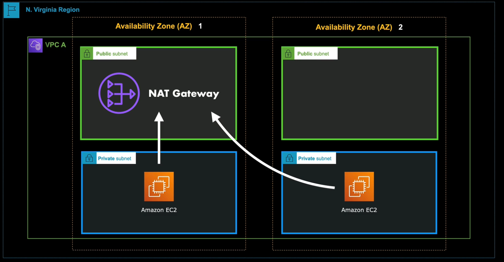
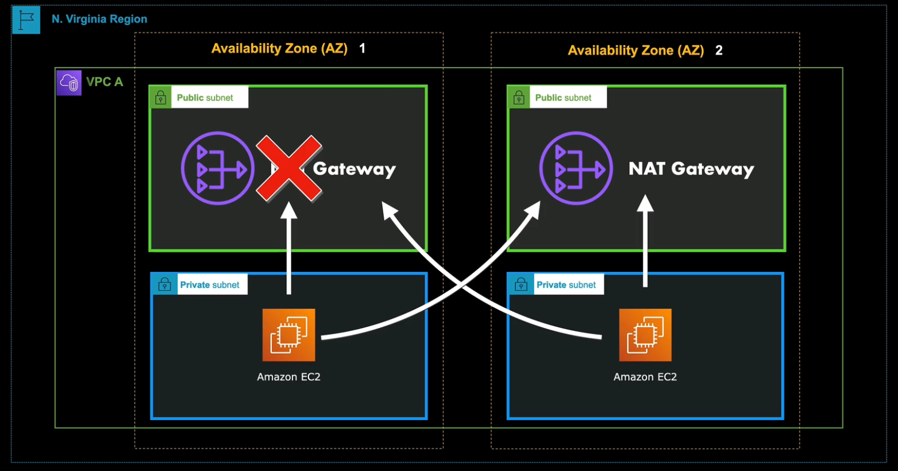

# Amazon VPC Network Architectures

## Default VPC
- There is a default VPC in each AWS Region.
- Can immediately be used to launch your Amazon EC2 instances, Elastic Load Balancers, Amazon RDS databases, and other resources.
- Perfect for quickly launching simple public websites or applications.
- The existing components of your VPC can be configured.
- Has an attached Internet Gateway by default.
- IPv4 CIDR Range: 172.31.0.0/16
    - A class B private IP address range that provides 65,536 IP addresses. First 4 and last IP address of that range are reserved.
        - 172.31.0.0 - Network Address
        - 172.31.0.1 - VPC router
        - 172.31.0.2 - DNS Server
        - 172.31.0.3 - Reserved for future use
        - 172.31.255.255 - Network Broadcast Address
    - Usually, the DNS server of your VPC is often your IP network + 2 (172.31.0.2).
- It also divides the massive network into smaller subnets. Creates a default subnet in each availability zone with a prefix size of /20.
    - Provides 4,096 addresses per subnet
    - Also reserves several IP addresses for each subnet. It may reserve something like ~6 IP address
- Also has a route table, internet gateway, default DHCP options set, default security group, and a default network ACL.
    - The main route has a route that points all traffic to the internet gateway, represented by 0.0.0.0 non-routable meta address.
        - This means that launching a service like an EC2 instance, that instance can access the internet and vice-versa.

## Amazon VPC Console Wizard
Using the configuration wizard can create the following configurations:
- A VPC with a single public subnet
    - Suitable for running a single tier public-facing web application, such as a publicly accessible website or blog.
    - Includes a VPC with a single public subnet and an internet gateway
    - Can be configured as a IPv6 with an IPv6 CIDR block.
- A VPC with a public and private subnets
    - Suitable for public-facing web application with back-end servers that must not be accessible for the public internet.
    - You can securely protect your private servers from vulnerabilities by placing them in private subnets.
    - You can allow EC2 instances in private subnets to access the internet by using a network address translation or NAT gateway. This NAT gateway resides in the public subnet and allows the instances in the private subnet to connect to the public internet.
        - This way, private services such as DBs can connect to the internet to fetch software updates but requests initiated from the internet wont be able to establish connections to your resources.
    - Can be configured as a IPv6 with an IPv6 CIDR block.
- A VPC with a public and private subnets and Hardware VPN Access
    - Similar to the previous type but contains a Virtual Private Gateway that enables communication with your own on-premise network over an IPsec VPN tunnel.
    - Suitable if you want to extend your network into AWS and directly access the public internet from your VPC.
    - Can launch multi-tiered applications with highly scalable web tier hosted in a public subnet, and host your sensitive data in your private subnet.
    - Includes an AWS Site-to-Site VPN connection that integrates your on-premises network with your VPC through an IPsec tunnel.
    - Can be configured with IPv6, but with certain limitations:
        - AWS can only use IPv4 on your Site-to-Site VPN connection that is integrated with your virtual private gateway of your VPC. It does not support IPv6 for your VPN connection.
- A VPC with a private subnet only and Hardware VPN Access
    - Does not have an internet gateway attached.
    - Suitable if you want to extend your on-premises network into AWS cloud using Amazon's infrastructure without exposing your network to the internet.
    - IPv6 can also be optionally configured, but does not support IPv6 communication over your AWS Site-to-Site VPN connection.

These types are just templates that you can modify! You can launch multiple subnets to improve availability of your system.

- If you need private subnets that need to make requests to the internet but not allow any to it, you can launch one or more NAT gateways to your VPC. One NAT gateway be be applied to multiple AWS resources that are across multiple AZs.
- You can also launch a NAT gateway in multiple AZ so that if one has a significant load or an outage, you have other NAT gateways available.

## Sidenote : Why does the CIDR block size matter?
- Its important to know how small or how large your VPC network will be based on the CIDR block prefix you define.
- Example, if you create one with a small prefix of /28 and launch an enterprise application to an auto scaling group of EC2 instances. 
    - If there's a surge of incoming request and auto scaling launches 16 new EC2 instances, then that operation will fail because a prefix of /28 has a total of 16 addresses.
    - (X) /28 = 16 Total IP addresses - 5 reserved AWS IPs = 11 usable IPs
    - (X) /27 = 32 Total IP addresses - 5 reserved AWS IPs = 27 usable IPs
    - (✓) /26 = 64 Total IP addresses - 5 reserved AWS IPs = 59 usable IPs